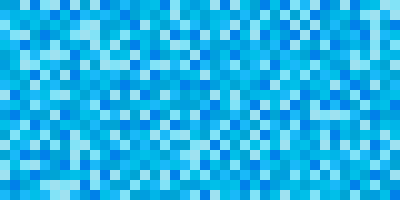

This is a toy app which generates pixel grids, like so:



It comes with a CLI app (`stickergen`) and has been transpiled to javascript with [gopherjs](https://github.com/gopherjs/gopherjs) so it can be embedded in web apps.

Command line options:

  --rows value, -r value      (default: 50)
  --cols value, -c value      (default: 72)
  --cellsize value, -s value  (default: 35)
  --outfile value, -o value   (default: "output.png")
  --palette value, -p value   (default: "random")


To use javascript, include the script:

```
<script src="stickergen.js"></script>
```

And then call the function:

```
var img = generateImage(rows, columns, cellsize, firstColor, secondColor)
```

The returned value is a Data URI encoded PNG, so can be assigned as the `src` attribute of an `img` element. Example usage:

```
</img>

...
myImg = document.getElementById("targetImg")
myImg.src = generateImage(40, 80, 9, "#f21326", "#eac4f9")
```

There is a more fully worked example in `index.html` in this repository.
